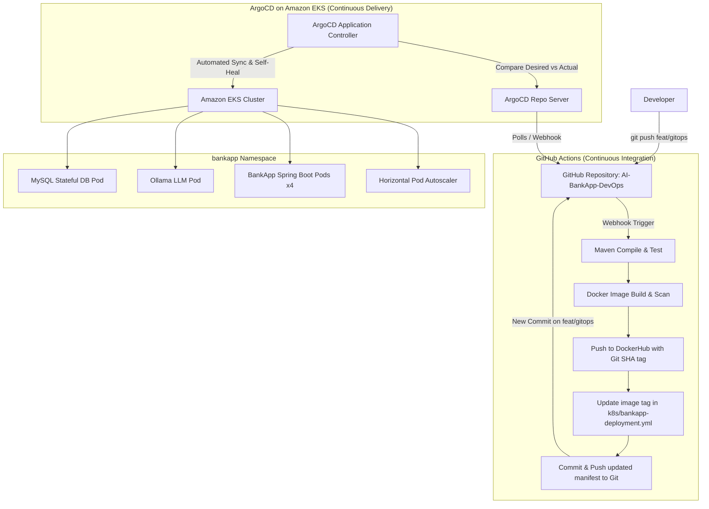

# Day 84 — Introduction to GitOps and ArgoCD

## 🚀 Overview

In earlier stages of our cloud-native deployment journey, we deployed the **AI-BankApp** onto Amazon EKS using imperative commands like `kubectl apply -f k8s/`. While this approach works for quick experiments, it introduces severe challenges in production environments:
* **Who ran the command?** No auditable trace of individual team member executions.
* **From which workstation?** Environments vary, leading to inconsistencies.
* **Was the applied manifest identical to Git?** Imperative changes risk uncommitted local edits.
* **Cluster Drift:** If an engineer manually alters a Deployment or ConfigMap on the live cluster during an incident, how do we detect, track, or revert it?

**GitOps** solves all of these fundamental issues. Under GitOps, **Git becomes the single source of truth** for both infrastructure and application states. A Kubernetes-native operator continuously monitors the repository and synchronizes the live cluster state with the declared configuration.

In this hands-on project, we explore **ArgoCD** deployed on our AWS EKS cluster, dissect the GitOps workflow for the **AI-BankApp**, configure automated synchronization and self-healing, and validate ArgoCD's drift detection through real-world failure injection tests.

---

## 📌 Table of Contents

1. [Understanding GitOps Principles](#-understanding-gitops-principles)
2. [GitOps vs Traditional CI/CD](#-gitops-vs-traditional-cicd)
3. [The AI-BankApp GitOps Architecture & Workflow](#-the-ai-bankapp-gitops-architecture--workflow)
4. [Four Core Principles of OpenGitOps](#-four-core-principles-of-opengitops)
5. [Accessing and Configuring ArgoCD on Amazon EKS](#-accessing-and-configuring-argocd-on-amazon-eks)
6. [Deep-Dive: The ArgoCD Application Manifest](#-deep-dive-the-argocd-application-manifest)
7. [Deploying AI-BankApp with ArgoCD](#-deploying-ai-bankapp-with-argocd)
8. [ArgoCD Live View & Resource Topology Tree](#-argocd-live-view--resource-topology-tree)
9. [Hands-On Drift Detection & Self-Healing Tests](#-hands-on-drift-detection--self-healing-tests)
10. [Key Technical Concepts: Prune, SelfHeal & ServerSideApply](#-key-technical-concepts-prune-selfheal--serversideapply)
11. [Summary & Key Takeaways](#-summary--key-takeaways)

---

## 🧠 Understanding GitOps Principles

### What is GitOps?

**GitOps** is an operational framework and deployment methodology where an entire system's desired state is declaratively stored and version-controlled inside a **Git repository**. An automated software agent (such as **ArgoCD**) continuously compares the system's live state in the cluster with the desired state defined in Git. 

If discrepancies arise between the repository and the cluster:
1. **Automated Synchronization:** The agent applies the updated manifests to the cluster.
2. **Self-Healing (Drift Correction):** If unauthorized or manual modifications occur directly in the cluster, the agent automatically reverts the changes back to the state declared in Git.
3. **Auditability & Governance:** All changes must flow through Git commits and Pull Requests (PRs), providing code reviews, automated CI tests, and an immutable audit trail.

```text
+-----------------------+           Continuous Pull & Sync           +------------------------+
|    Git Repository     |  <======================================>  |     ArgoCD Engine      |
| (Desired State Truth) |                                            | (Reconciliation Loop)  |
+-----------------------+                                            +-----------+------------+
                                                                                 |
                                                            Reconciles Live State|
                                                                                 v
                                                                     +------------------------+
                                                                     |     Amazon EKS         |
                                                                     |     (Actual State)     |
                                                                     +------------------------+
```

---

## ⚖️ GitOps vs Traditional CI/CD

The shift from traditional CI/CD to GitOps represents a fundamental architectural change from a **Push-based model** to a **Pull-based model**.

| Aspect | Traditional CI/CD (Push Model) | GitOps with ArgoCD (Pull Model) |
| :--- | :--- | :--- |
| **Deployment Trigger** | CI pipeline script executes `kubectl apply` or Helm push | Git commit/merge triggers an internal pull & sync |
| **Source of Truth** | Pipeline definitions, CI variables, cluster state | Git repository (`k8s/` manifests) |
| **Drift Detection** | None. Cluster drift remains undetected until the next run | Continuous reconciliation loop (checks every 3 minutes) |
| **Rollback Mechanism** | Re-run legacy pipelines or perform ad-hoc hotfixes | Standard `git revert` or instant one-click ArgoCD rollback |
| **Audit Trail** | Ephemeral CI/CD job logs and console history | Git commit history, pull request approvals, blame logs |
| **Cluster Access & Credentials** | CI server requires full administrative cluster credentials | Zero external cluster credentials needed; ArgoCD runs inside |
| **Security Posture** | Large blast radius if CI runner is compromised | Least-privilege model; developers push to Git, never to cluster |
| **Self-Healing** | Absent; manual edits persist indefinitely | Automatic; unauthorized changes are reverted in real-time |

---

## 🔄 The AI-BankApp GitOps Architecture & Workflow

In the AI-BankApp system, the CI pipeline and CD pipeline are cleanly decoupled:



### The End-to-End Execution Sequence:
1. **Developer Push:** Developer commits code to the `feat/gitops` branch.
2. **CI Pipeline Runs:** GitHub Actions compiles the Java application, runs unit tests, builds the container image, tags it with the Git commit SHA, and publishes it to DockerHub.
3. **Manifest Update in Git:** The CI runner modifies `k8s/bankapp-deployment.yml` with the new image tag and commits the change back to the repository.
4. **ArgoCD Polls & Detects:** ArgoCD watches the repository, detects the commit diff, and flags the application as `OutOfSync`.
5. **Continuous Reconciliation:** ArgoCD applies the changes via Kubernetes Server-Side Apply.
6. **Rolling Update:** The BankApp deployment rolls out the new pods cleanly without downtime.
7. **Zero Human Cluster Access:** No engineer or external CI runner ever ran `kubectl apply`.

---

## 📜 Four Core Principles of OpenGitOps

According to the **OpenGitOps** standard (managed by the CNCF GitOps Working Group), a compliant system adheres to four core tenets:

1. **Declarative State:**
   * The desired state of the system is expressed declaratively using structured formats (Kubernetes YAML manifests, Helm charts, Kustomize). We describe *what* we want, not *how* to build it.
2. **Versioned and Immutable:**
   * The desired state is stored in a version-controlled store that supports immutability and version history (Git). Every release, change, and rollback is permanently tracked.
3. **Pulled Automatically:**
   * Software agents automatically pull the desired state from the source of truth. Cluster credentials remain strictly internal rather than exposed to external CI servers.
4. **Continuously Reconciled:**
   * Software agents continuously monitor the state of the system. Whenever actual state drifts from desired state, the agent self-heals the cluster back to the desired specification.

---

## 🛠️ Accessing and Configuring ArgoCD on Amazon EKS

ArgoCD was provisioned on our AWS EKS cluster during our Terraform infrastructure deployment (via `terraform/argocd.tf`).

### Step 1: Verify ArgoCD Pods in the `argocd` Namespace

```bash
kubectl get pods -n argocd -o wide
```

**Output:**
```text
NAME                                                READY   STATUS    RESTARTS   AGE   IP             NODE
argocd-application-controller-0                     1/1     Running   0          2d    10.0.1.42      ip-10-0-1-12.ec2.internal
argocd-applicationset-controller-7c9869854b-dklm9   1/1     Running   0          2d    10.0.2.115     ip-10-0-2-34.ec2.internal
argocd-dex-server-6784d854fb-q5z6w                  1/1     Running   0          2d    10.0.1.88      ip-10-0-1-12.ec2.internal
argocd-redis-74b8897585-7j28m                       1/1     Running   0          2d    10.0.2.74      ip-10-0-2-34.ec2.internal
argocd-repo-server-5d97f56cf-v8x2b                  1/1     Running   0          2d    10.0.1.19      ip-10-0-1-12.ec2.internal
argocd-server-85dbbc88bd-kprst                      1/1     Running   0          2d    10.0.2.190     ip-10-0-2-34.ec2.internal
```

#### Core Components Overview:
* **`argocd-server`:** Exposes the API and Web UI, handles authentication and RBAC.
* **`argocd-repo-server`:** Clones the Git repository and generates Kubernetes manifests.
* **`argocd-application-controller`:** The core engine that continuously compares live cluster state against Git manifests and reconciles differences.
* **`argocd-redis`:** Caches Git repository states and manifest outputs for high performance.
* **`argocd-dex-server`:** Manages identity provider integration and OpenID Connect (OIDC).
* **`argocd-applicationset-controller`:** Automates multi-cluster and multi-tenant application generation.

---

### Step 2: Retrieve the ArgoCD Admin Password

The initial admin password is automatically generated during deployment and stored in a Kubernetes secret:

```bash
kubectl -n argocd get secret argocd-initial-admin-secret \
  -o jsonpath="{.data.password}" | base64 -d && echo
```

**Output:**
```text
k9XyZ78A1bC2dE3fG4hI
```

---

### Step 3: Access the ArgoCD Web User Interface

#### Option A — Via External LoadBalancer:
```bash
export ARGOCD_URL=$(kubectl get svc argocd-server -n argocd -o jsonpath='{.status.loadBalancer.ingress[0].hostname}')
echo "ArgoCD Web URL: http://$ARGOCD_URL"
```

#### Option B — Via Local Port Forwarding:
```bash
kubectl port-forward svc/argocd-server -n argocd 8443:443
```

Navigate to `https://localhost:8443` in a web browser, bypass the self-signed certificate warning, and authenticate with:
* **Username:** `admin`
* **Password:** `<retrieved-initial-admin-password>`

---

### Step 4: Install and Authenticate the ArgoCD CLI

#### Installation:
* **Windows (PowerShell / Chocolatey / Scoop):**
  ```powershell
  choco install argocd-cli
  # or scoop
  scoop install argocd
  ```
* **Linux:**
  ```bash
  curl -sSL -o argocd https://github.com/argoproj/argo-cd/releases/latest/download/argocd-linux-amd64
  chmod +x argocd && sudo mv argocd /usr/local/bin/
  ```
* **macOS:**
  ```bash
  brew install argocd
  ```

#### Authenticate via CLI:
```bash
# If using port-forward:
argocd login localhost:8443 --username admin --password <password> --insecure

# If using LoadBalancer:
argocd login $ARGOCD_URL --username admin --password <password> --insecure
```

**Verification:**
```bash
argocd version
```

---

## 🔍 Deep-Dive: The ArgoCD Application Manifest

ArgoCD uses a Custom Resource Definition (CRD) called `Application` (`argoproj.io/v1alpha1`) to bind a Git repository source to a target Kubernetes cluster destination.

Here is the exact manifest used for the **AI-BankApp**:

```yaml
apiVersion: argoproj.io/v1alpha1
kind: Application
metadata:
  name: bankapp
  namespace: argocd
  finalizers:
    - resources-finalizer.argocd.argoproj.io
spec:
  project: default
  source:
    repoURL: https://github.com/Aishwary-gupta/AI-BankApp-DevOps.git
    targetRevision: feat/gitops
    path: k8s
  destination:
    server: https://kubernetes.default.svc
    namespace: bankapp
  syncPolicy:
    automated:
      prune: true
      selfHeal: true
    syncOptions:
      - CreateNamespace=true
      - ServerSideApply=true
```

### Manifest Breakdown Table:

| Field Path | Configured Value | Architectural Purpose |
| :--- | :--- | :--- |
| `apiVersion` | `argoproj.io/v1alpha1` | Identifies the ArgoCD API version for application management. |
| `kind` | `Application` | Specifies the Custom Resource type representing the managed workload. |
| `metadata.name` | `bankapp` | Unique identifier for this application inside ArgoCD. |
| `metadata.namespace` | `argocd` | The namespace where the ArgoCD control plane resides and tracks the CR. |
| `metadata.finalizers` | `resources-finalizer...` | Ensures that deleting the ArgoCD application cleans up all managed cluster resources. |
| `spec.project` | `default` | Logical grouping for RBAC, allowed sources, and target clusters. |
| `spec.source.repoURL` | `https://github.com/Aishwary-gupta/AI-BankApp-DevOps.git` | Target Git repository containing the Kubernetes manifests. |
| `spec.source.targetRevision`| `feat/gitops` | Target branch or commit SHA to track and synchronize from. |
| `spec.source.path` | `k8s` | Subdirectory inside the Git repo where the YAML manifests live. |
| `spec.destination.server` | `https://kubernetes.default.svc` | The in-cluster Kubernetes API server endpoint of the EKS cluster. |
| `spec.destination.namespace`| `bankapp` | The target namespace where application pods and services are deployed. |
| `spec.syncPolicy.automated` | `true` | Tells ArgoCD to automatically synchronize when Git changes are detected. |
| `syncPolicy.automated.prune`| `true` | Deletes cluster resources if their YAML manifests are removed from Git. |
| `syncPolicy.automated.selfHeal`| `true` | Reverts any manual changes or drift applied directly to the cluster back to Git. |
| `syncOptions: CreateNamespace=true` | Enabled | Automatically creates the `bankapp` target namespace if it does not exist. |
| `syncOptions: ServerSideApply=true` | Enabled | Uses Kubernetes Server-Side Apply to avoid annotation bloat and manage field ownership cleanly. |

---

## 🚀 Deploying AI-BankApp with ArgoCD

### Step 1: Clean Slate Verification

Before handing management over to ArgoCD, ensure that no stale workloads conflict with the deployment:

```bash
kubectl delete namespace bankapp 2>/dev/null || true
```

### Step 2: Apply the ArgoCD Application Resource

We apply the `Application` manifest directly to the EKS cluster:

```bash
kubectl apply -f application.yml
```

**Output:**
```text
application.argoproj.io/bankapp created
```

---

### Step 3: Watch the Deployment & Synchronization Progress

Check application status through the ArgoCD CLI:

```bash
argocd app get bankapp
```

**CLI Output:**
```text
Name:               argocd/bankapp
Project:            default
Server:             https://kubernetes.default.svc
Namespace:          bankapp
URL:                https://localhost:8443/applications/bankapp
Repo:               https://github.com/Aishwary-gupta/AI-BankApp-DevOps.git
Target:             feat/gitops
Path:               k8s
Sync Window:        Sync Allowed
Sync Status:        Synced to feat/gitops (a1b2c3d)
Health Status:      Healthy

GROUP  KIND                   NAMESPACE  NAME             STATUS   HEALTH       HOOK  MESSAGE
       Namespace                         bankapp          Running  Synced             namespace/bankapp created
       ConfigMap              bankapp    bankapp-config   Synced                      configmap/bankapp-config created
       Secret                 bankapp    bankapp-secret   Synced                      secret/bankapp-secret created
       PersistentVolumeClaim  bankapp    mysql-pvc        Synced   Bound              persistentvolumeclaim/mysql-pvc created
       PersistentVolumeClaim  bankapp    ollama-pvc       Synced   Bound              persistentvolumeclaim/ollama-pvc created
       Service                bankapp    mysql-service    Synced   Healthy            service/mysql-service created
       Service                bankapp    ollama-service   Synced   Healthy            service/ollama-service created
       Service                bankapp    bankapp-service  Synced   Healthy            service/bankapp-service created
apps   Deployment             bankapp    mysql            Synced   Healthy            deployment.apps/mysql created
apps   Deployment             bankapp    ollama           Synced   Healthy            deployment.apps/ollama created
apps   Deployment             bankapp    bankapp          Synced   Healthy            deployment.apps/bankapp created
autoscaling HorizontalPodAutoscaler bankapp bankapp-hpa   Synced   Healthy            horizontalpodautoscaler.autoscaling/bankapp-hpa created
```

Wait until all resources report `Healthy` and `Synced`:
```bash
argocd app wait bankapp
```

---

### Step 4: Verify Running Pods in the `bankapp` Namespace

```bash
kubectl get pods -n bankapp -o wide
```

**Output:**
```text
NAME                       READY   STATUS    RESTARTS   AGE     IP            NODE
bankapp-6f97f7bd8d-7xk4p   1/1     Running   0          4m30s   10.0.1.140    ip-10-0-1-12.ec2.internal
bankapp-6f97f7bd8d-b28nv   1/1     Running   0          4m30s   10.0.2.199    ip-10-0-2-34.ec2.internal
bankapp-6f97f7bd8d-m5z9q   1/1     Running   0          4m30s   10.0.1.182    ip-10-0-1-12.ec2.internal
bankapp-6f97f7bd8d-rq8tl   1/1     Running   0          4m30s   10.0.2.85     ip-10-0-2-34.ec2.internal
mysql-7c98895b64-vx9zm     1/1     Running   0          5m12s   10.0.1.201    ip-10-0-1-12.ec2.internal
ollama-84f9bb8c4-pl89x     1/1     Running   0          5m12s   10.0.2.45     ip-10-0-2-34.ec2.internal
```

The startup ordering occurred transparently:
1. `mysql` and `ollama` initialized first with their persistent storage (`gp3` EBS CSI driver).
2. The `bankapp` Spring Boot application pods utilized Kubernetes init containers to verify connectivity to both the MySQL database and the Ollama AI inference service before starting the primary application container.

---

## 🌳 ArgoCD Live View & Resource Topology Tree

Inside the ArgoCD Web UI, the application displays a complete visual dependency graph:

```text
========================================================================================
                                     bankapp (Application)
                                  [Synced]  ●  [Healthy]
========================================================================================
  │
  ├── Namespace: bankapp
  │
  ├── StorageClass: gp3 (AWS EBS CSI Driver)
  │     ├── PVC: mysql-pvc [Bound]
  │     └── PVC: ollama-pvc [Bound]
  │
  ├── ConfigMap: bankapp-config
  ├── Secret: bankapp-secret
  │
  ├── Deployment: mysql
  │     └── ReplicaSet: mysql-7c98895b64
  │           └── Pod: mysql-7c98895b64-vx9zm [Running - 1/1]
  │
  ├── Deployment: ollama
  │     └── ReplicaSet: ollama-84f9bb8c4
  │           └── Pod: ollama-84f9bb8c4-pl89x [Running - 1/1]
  │
  ├── Deployment: bankapp
  │     └── ReplicaSet: bankapp-6f97f7bd8d
  │           ├── Pod: bankapp-6f97f7bd8d-7xk4p [Running - 1/1]
  │           ├── Pod: bankapp-6f97f7bd8d-b28nv [Running - 1/1]
  │           ├── Pod: bankapp-6f97f7bd8d-m5z9q [Running - 1/1]
  │           └── Pod: bankapp-6f97f7bd8d-rq8tl [Running - 1/1]
  │
  ├── Service: mysql-service [ClusterIP: 172.20.140.22]
  ├── Service: ollama-service [ClusterIP: 172.20.210.88]
  ├── Service: bankapp-service [LoadBalancer: a89bf...elb.amazonaws.com]
  │
  └── HPA: bankapp-hpa [Min: 2 / Max: 10 / Target CPU: 70%]
```

### Observability Features in ArgoCD UI:
* **Live Pod Log Streaming:** Direct access to container stdout/stderr without requiring `kubectl logs`.
* **Cluster Events & Health:** Real-time visibility into pod restarts, scheduling events, and image pull statuses.
* **Manifest Inspection:** Instant side-by-side comparison between the live YAML applied on Kubernetes and the target YAML committed in Git.
* **Sync History & Rollback:** Historical record of every sync event, commit SHA, and author.

```bash
argocd app history bankapp
```

**Output:**
```text
ID  DATE                           REVISION                                  AUTHOR
1   2026-10-07 05:45:10 +0000 UTC  feat/gitops (a1b2c3d4e5f6g7h8i9j0k1l2m3)  Aishwary Gupta <aishwaryg448@gmail.com>
```

---

## 🛡️ Hands-On Drift Detection & Self-Healing Tests

The true superpower of GitOps lies in **Self-Healing (`selfHeal: true`)**. In a traditional cluster, manual modifications ("hotfixes") cause configuration drift and undocumented breaking changes. With ArgoCD, **manual changes do not survive**.

We conducted three failure-injection experiments to validate self-healing:

---

### Test 1: Manual Scaling Drift Test

**Scenario:** An unauthorized engineer attempts to manually scale down the `bankapp` deployment to 1 replica directly via `kubectl`.

#### Action:
```bash
kubectl scale deployment bankapp -n bankapp --replicas=1
```

#### Observation:
Immediately after the command, Kubernetes begins terminating pods:
```bash
kubectl get pods -n bankapp -l app=bankapp
```
```text
NAME                       READY   STATUS        RESTARTS   AGE
bankapp-6f97f7bd8d-7xk4p   1/1     Running       0          10m
bankapp-6f97f7bd8d-b28nv   1/1     Terminating   0          10m
bankapp-6f97f7bd8d-m5z9q   1/1     Terminating   0          10m
bankapp-6f97f7bd8d-rq8tl   1/1     Terminating   0          10m
```

#### ArgoCD Self-Healing Reaction:
ArgoCD's application controller detects that the live cluster deployment has `spec.replicas: 1`, while Git specifies `spec.replicas: 4`. 
Because `selfHeal: true` is active, ArgoCD immediately intervenes and enforces the Git desired state:

```bash
kubectl get events -n argocd --field-selector reason=ResourceUpdated
```
```text
LAST SEEN   TYPE     REASON            OBJECT            MESSAGE
15s         Normal   ResourceUpdated   application/bankapp  Updated deployment bankapp to match Git revision a1b2c3d
```

Within seconds, the controller scales the deployment back to 4 replicas and launches replacement pods:
```bash
kubectl get pods -n bankapp -l app=bankapp
```
```text
NAME                       READY   STATUS    RESTARTS   AGE
bankapp-6f97f7bd8d-7xk4p   1/1     Running   0          11m
bankapp-6f97f7bd8d-w49px   1/1     Running   0          25s
bankapp-6f97f7bd8d-v72lk   1/1     Running   0          25s
bankapp-6f97f7bd8d-kd81s   1/1     Running   0          25s
```
**Result:** Drift successfully detected and remediated. Pod count restored to 4.

---

### Test 2: Resource Deletion Drift Test

**Scenario:** An operator accidentally deletes the application ConfigMap in the cluster.

#### Action:
```bash
kubectl delete configmap bankapp-config -n bankapp
```

**Output:**
```text
configmap "bankapp-config" deleted
```

#### Observation & Self-Healing Reaction:
Checking the cluster status:
```bash
kubectl get configmap bankapp-config -n bankapp
```
Immediately following deletion, ArgoCD identifies a missing resource declared in `k8s/bankapp-configmap.yml`:
```text
NAME             DATA   AGE
bankapp-config   3      4s
```
ArgoCD detected the missing object and recreated `bankapp-config` automatically from the Git repository.

**Result:** Cluster state healed with zero downtime for dependent application pods.

---

### Test 3: Unauthorized Configuration Mutation Test

**Scenario:** An operator uses `kubectl edit` to manually alter database environment variables in the ConfigMap.

#### Action:
```bash
kubectl patch configmap bankapp-config -n bankapp --type merge -p '{"data":{"SPRING_DATASOURCE_URL":"jdbc:mysql://unauthorized-host:3306/bankdb"}}'
```

#### Observation:
```bash
kubectl get configmap bankapp-config -n bankapp -o jsonpath='{.data.SPRING_DATASOURCE_URL}'
```

#### ArgoCD Reconciliation:
In the ArgoCD dashboard, the application briefly flashes as `OutOfSync` with a detected diff:
```text
Diff:
- SPRING_DATASOURCE_URL: jdbc:mysql://mysql-service:3306/bankappdb
+ SPRING_DATASOURCE_URL: jdbc:mysql://unauthorized-host:3306/bankdb
```

Within seconds, the continuous reconciliation loop overwrites the modified ConfigMap with the Git original:
```bash
kubectl get configmap bankapp-config -n bankapp -o jsonpath='{.data.SPRING_DATASOURCE_URL}'
```
**Output:**
```text
jdbc:mysql://mysql-service:3306/bankappdb
```

**Result:** Unauthorized mutation was completely overridden by the single source of truth in Git.

---

### Self-Healing Summary Matrix

| Failure Injected | Manual Action Executed | Observed Drift | ArgoCD Action | Recovery Time | Final Outcome |
| :--- | :--- | :--- | :--- | :--- | :--- |
| **Pod Downscale** | `kubectl scale --replicas=1` | Cluster had 1 pod vs 4 in Git | Triggers automated sync, updates ReplicaSet | ~15 seconds | Deployment scaled back to 4 pods |
| **ConfigMap Deletion** | `kubectl delete configmap` | ConfigMap missing from cluster | Reapplies manifest from Git repo | ~4 seconds | ConfigMap recreated immediately |
| **Env Var Mutation** | `kubectl patch configmap` | Database URL changed maliciously | Detects field diff, rewrites from Git | ~20 seconds | Original database URL restored |

---

## 🔑 Key Technical Concepts: Prune, SelfHeal & ServerSideApply

In the ArgoCD `syncPolicy`, three specific configurations drive enterprise GitOps workflows:

### 1. `prune: true`
* **What it does:** Ensures that whenever a Kubernetes manifest file is deleted from the Git repository, ArgoCD automatically deletes that corresponding resource from the live Kubernetes cluster.
* **Why it matters:** Without `prune: true`, deleting a YAML file from Git leaves behind **orphaned resources** (zombie pods, abandoned secrets, unused services) running in the cluster indefinitely.
* **Safety note:** You can protect critical resources (such as stateful PVCs or production databases) from being pruned by adding the annotation `argocd.argoproj.io/sync-options: Prune=false`.

### 2. `selfHeal: true`
* **What it does:** Continuously reconciles cluster state against Git. If any resource in the cluster drifts away from the Git specification (due to manual `kubectl edit`, scaling, or deletion), ArgoCD automatically reverts the cluster back to match Git.
* **Why it matters:** Enforces the fundamental GitOps rule that **Git is the sole authority**. It stops accidental or rogue manual changes from creating configuration drift.
* **Note:** `selfHeal` requires `automated` sync to be enabled.

### 3. `ServerSideApply=true`
* **What it does:** Uses the Kubernetes API server's native **Server-Side Apply (SSA)** feature rather than traditional client-side apply (`kubectl apply`).
* **Why it matters:**
  1. **Resolves Annotation Size Limits:** Traditional `kubectl.kubernetes.io/last-applied-configuration` annotations frequently exceed the 256KB metadata limit for large manifests (e.g., CRDs). SSA eliminates this annotation.
  2. **Field Management:** Tracks field ownership cleanly so multiple controllers can manage different fields of the same resource without conflict.
  3. **Performance:** Shift reconciliation logic to the Kubernetes API server for faster, safer diff computation.

---

## 💡 Summary & Key Takeaways

1. **Imperative vs Declarative:** Replacing `kubectl apply` with GitOps eliminates undocumented changes, credential leakage, and configuration drift.
2. **Security by Design:** External CI runners never require administrative credentials to access the Kubernetes cluster. ArgoCD securely pulls changes from inside the network perimeter.
3. **Auditability & Traceability:** Every change to the AI-BankApp infrastructure or code is represented by a signed, reviewable Git commit.
4. **Resilience & Self-Healing:** Manual interventions and accidental cluster deletions are instantly corrected by ArgoCD's continuous reconciliation loop.
5. **Fast Rollbacks:** Rolling back a failed deployment in production is as simple as running `git revert <commit-sha>`.

---

## 📌 Useful Commands Reference

```bash
# Verify ArgoCD Pods
kubectl get pods -n argocd

# Retrieve Initial Admin Password
kubectl -n argocd get secret argocd-initial-admin-secret -o jsonpath="{.data.password}" | base64 -d && echo

# Port Forward ArgoCD Server
kubectl port-forward svc/argocd-server -n argocd 8443:443

# Login via CLI
argocd login localhost:8443 --username admin --insecure

# Create / Apply Application
kubectl apply -f application.yml

# Check Application Status & Sync
argocd app get bankapp
argocd app sync bankapp
argocd app history bankapp

# Test Self-Healing by Triggering Drift
kubectl scale deployment bankapp -n bankapp --replicas=1
kubectl get pods -n bankapp -w
```
